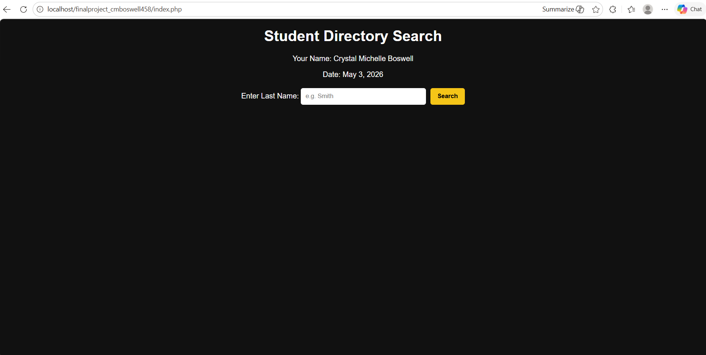
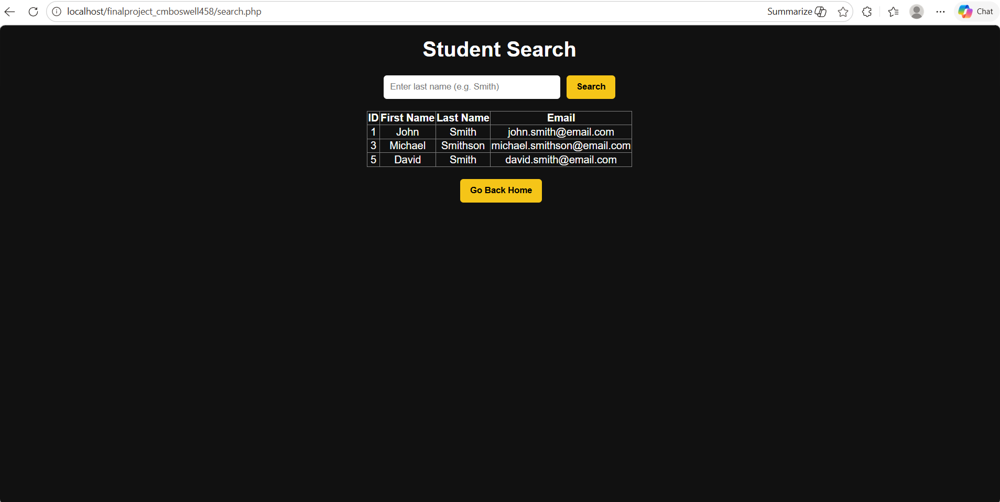
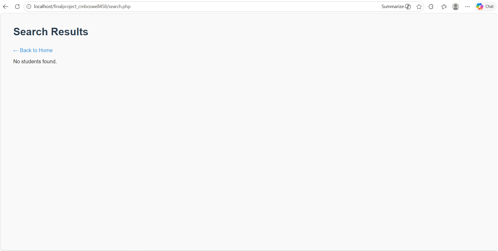

# Student Directory Search Project

## 📌 Overview
This project is a PHP-based web application that allows users to search for students by last name. It connects to a MySQL database and uses a stored procedure to securely retrieve matching student records.

The application demonstrates full stack development concepts including frontend design, backend processing, and database interaction.

---

## 🚀 Features
- Search students by last name (partial matches supported)
- Uses a MySQL stored procedure (`search_students`)
- Secure database access with prepared statements
- Displays results in a styled table
- Handles no-result cases gracefully
- Clean and responsive layout using external CSS
- JavaScript welcome alert on homepage

---

## 🛠️ Technologies Used
- PHP
- MySQL / phpMyAdmin
- HTML5
- CSS3
- JavaScript

---

## 📂 Project Structure
```
finalproject_cmboswell458/
│
├── index.php
├── search.php
├── README.md
│
├── styles/
│   └── main.css
│
├── scripts/
│   └── main.js
│
├── media/
│   ├── homepage.png
│   ├── search-results.png
│   └── no-results.png
```

---

## 🗄️ Database Setup

### Create Database
```
student_directory
```

### Create Table
```sql
CREATE TABLE students (
    id INT AUTO_INCREMENT PRIMARY KEY,
    first_name VARCHAR(50),
    last_name VARCHAR(50),
    email VARCHAR(100)
);
```

### Insert Sample Data
```sql
INSERT INTO students (first_name, last_name, email) VALUES
('John', 'Smith', 'john.smith@email.com'),
('Sarah', 'Johnson', 'sarah.johnson@email.com'),
('Michael', 'Smithson', 'michael.smithson@email.com'),
('Emily', 'Davis', 'emily.davis@email.com'),
('David', 'Smith', 'david.smith@email.com');
```

### Create Stored Procedure
```sql
DELIMITER $$

CREATE PROCEDURE search_students(IN lName VARCHAR(50))
BEGIN
    SELECT * FROM students 
    WHERE last_name LIKE CONCAT(lName, '%');
END $$

DELIMITER ;
```

---

## ▶️ How to Run the Project
1. Place the project folder inside your AMPPS `www` directory  
2. Start Apache and MySQL in AMPPS  
3. Open your browser and go to:  
```
http://localhost/finalproject_cmboswell458/index.php
```
4. Enter a last name and click **Search**

---

## 🖼️ Screenshots

### Homepage


### Search Results


### No Results Found


---

## 👤 Author
Crystal Michelle Boswell

---

## 📅 Date
May 2026
